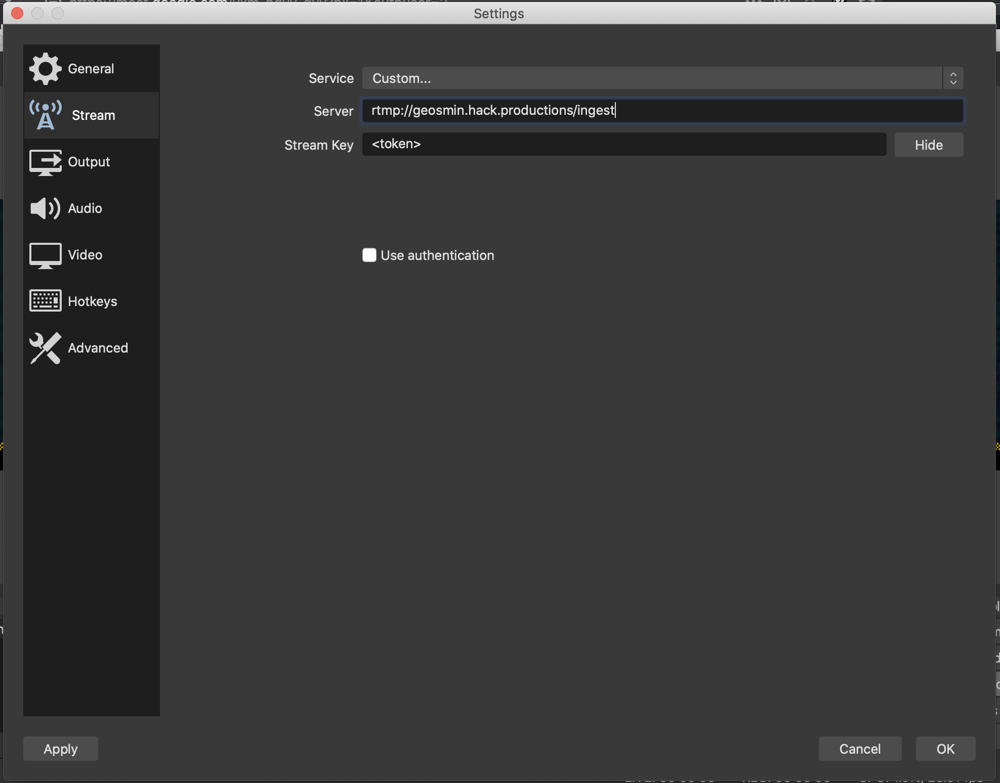

---

# Information for Workshop Hosts

Workshops will be live streamed onto [Twitch.TV](https://twitch.tv/hackquarantine).

There's 3 ways to do your workshop. Pick which ever you feel comfortable doing!

1. Perform workshop live (live stream only)
2. Play workshop video live from your computer (live stream + pre recorded)
3. Send us the prerecorded video and we will play it live (pre recorded only)

### Perform workshop live (live stream only)

1. Download and install [Open Broadcasting Software (OBS)](https://obsproject.com/)
2. Open OBS
3. Create a scene
4. Add a Display Capture or Window Capture source
5. Add an Audio Input Capture source for microphone
6. Optionally: if you’re on a Mac, follow [this guide](https://obsproject.com/forum/resources/os-x-capture-audio-with-ishowu-audio-capture.505/) to capture system audio.
7. Open OBS settings to add the `Server` and `Stream Key` (see below)
8. Press the `Start Streaming` button

We will be sending you a Stream Key and Upload URL via Discord before the event. Make sure to give your Discord username to Karl. 

Example Discord username: `wrussell1999#6267`

### Play workshop video live (live stream + pre recorded)

This option is useful if you don't want to perform your workshop live, but want to be able to **pause the workshop** to take questions / answer questions from hackers in the Twitch chat.

This will guide you on how to record your screen so you can show off slides, and code easily. You can also clean it up in editing later if you want.

1. Follow the same instructions as #1 up to 6 but instead of `Start Streaming`, press `Start Recording`.
2. If you want to edit your workshop, there's a few different types of video editing software you can use (unless you're familiar):
   1. [OpenShot](https://www.openshot.org/) (Windows, macOS, Linux)
   2. iMovie (macOS only)
   3. Follow the instructions [here](https://www.youtube.com/watch?v=hf457tY10MA) to setup OBS to replay your video.
   4. For live streaming, insert your stream key as mentioned above and press `Start Streaming`
   5. Switch to your scene you setup in step 3, and your video should start automatically playing.

### Testing your Livestream setup

We recommend that prior to the start of your workshop, you test your livestream configuration is able to connect to the ingest server using the following guide:

  1. Follow either of the two guides above to configure your streaming setup
  2. Set your custom RTMP url to rtmp://geosmin.hack.productions/test
  3. Press 'Start Streaming'
  3. Go to http://geosmin.hack.productions
  4. Confirm that the video and audio you are expecting to be streamed is replayed in your browser

### Send us the prerecorded video (pre recorded only)

This is the same as the previous option, but you won't be able to pause your video. If you don't want to pause your video to take questions, this will be the easiest option.

1. Follow the same instructions as #2 up to part 2.
2. Export your video as an `.mp4` (else it won't work).
3. You will be provided with a upload url as mentioned above. Click it, select the file, and once uploaded you're done!
4. If you have not pre-agreed that your content will be pre-recorded, please notify an organizer so that arrangements can be made to play your content during your assigned timeslot.
